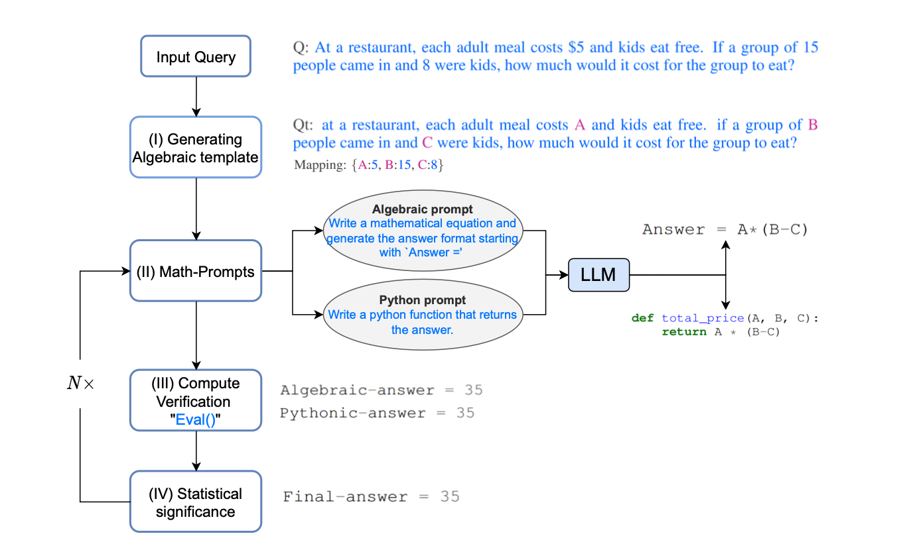

# Unit Prompter

- [ ] data collections
    - [ ] Kotlin Syntax
    - [ ] Spring Kotlin
    - [ ] Kotless Sample
- [ ] Test LLM
    - [ ] Alpaca-LoRA

## Generate Prompt

inspired by MathPrompter 

### Step 1. Aligning LM

[https://github.com/yizhongw/self-instruct](https://github.com/yizhongw/self-instruct) - Self-Instruct: Aligning LM with
Self Generated Instructions

### Step 2. Train with Alpaca Lora

### Step 3. Running Alpaca in Local

todos

## Resources for Unit Prompter

### Papers

[Self-Instruct: Aligning Language Model with Self Generated Instructions](https://arxiv.org/abs/2212.10560)

> Large "instruction-tuned" language models (finetuned to respond to instructions) have demonstrated a remarkable
> ability to generalize zero-shot to new tasks. Nevertheless, they depend heavily on human-written instruction data that
> is limited in quantity, diversity, and creativity, therefore hindering the generality of the tuned model. We introduce
> Self-Instruct, a framework for improving the instruction-following capabilities of pretrained language models by
> bootstrapping off its own generations. Our pipeline generates instruction, input, and output samples from a language
> model, then prunes them before using them to finetune the original model. Applying our method to vanilla GPT3, we
> demonstrate a 33% absolute improvement over the original model on Super-NaturalInstructions, on par with the
> performance
> of InstructGPT_001, which is trained with private user data and human annotations. For further evaluation, we curate a
> set of expert-written instructions for novel tasks, and show through human evaluation that tuning GPT3 with
> Self-Instruct outperforms using existing public instruction datasets by a large margin, leaving only a 5% absolute gap
> behind InstructGPT_001. Self-Instruct provides an almost annotation-free method for aligning pre-trained language
> models
> with instructions, and we release our large synthetic dataset to facilitate future studies on instruction tuning.

[MathPrompter: Mathematical Reasoning using Large Language Models](https://paperswithcode.com/paper/mathprompter-mathematical-reasoning-using)

> Large Language Models (LLMs) have limited performance when solving arithmetic reasoning tasks and often provide
> incorrect answers. Unlike natural language understanding, math problems typically have a single correct answer, making
> the task of generating accurate solutions more challenging for LLMs. To the best of our knowledge, we are not aware of
> any LLMs that indicate their level of confidence in their responses which fuels a trust deficit in these models impeding
> their adoption. To address this deficiency, we propose `MathPrompter', a technique that improves performance of LLMs on
> arithmetic problems along with increased reliance in the predictions. MathPrompter uses the Zero-shot chain-of-thought
> prompting technique to generate multiple Algebraic expressions or Python functions to solve the same math problem in
> different ways and thereby raise the confidence level in the output results. This is in contrast to other prompt based
> CoT methods, where there is no check on the validity of the intermediate steps followed. Our technique improves over
> state-of-the-art on the MultiArith dataset () evaluated using 175B parameter GPT-based LLM. 
